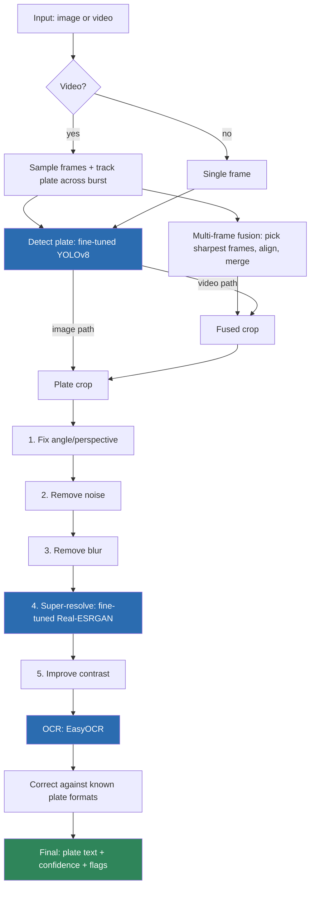
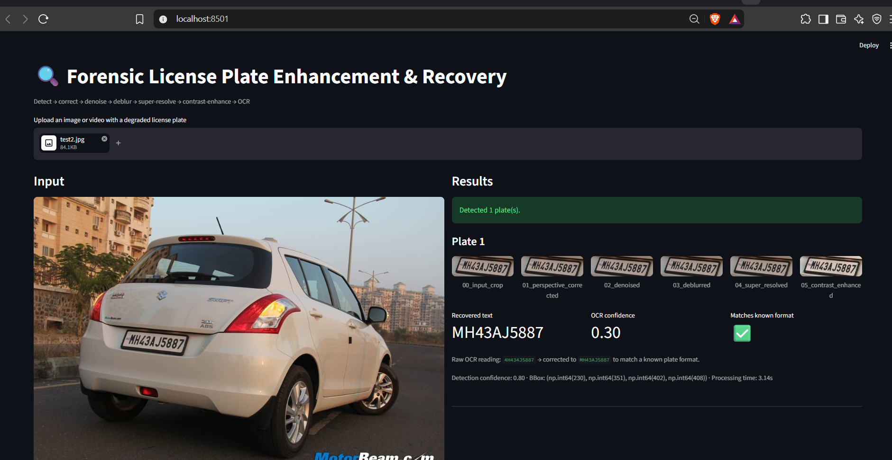
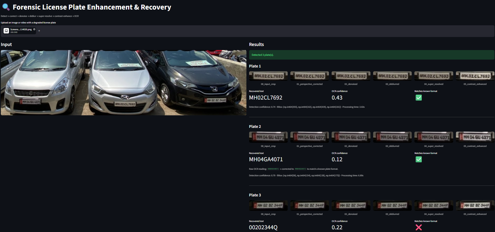
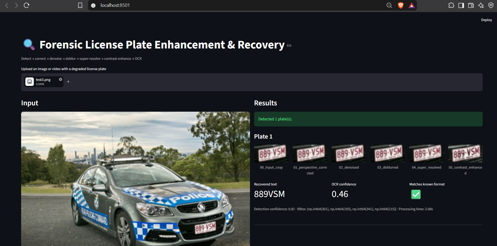

# Forensic License Plate Enhancement & Recovery

CerebralZip Internship Assignment — Assignment 2 (Computer Vision / Deep Learning)

A pipeline that takes degraded footage of vehicles (blurred, low-res,
skewed, noisy, or motion-affected) and recovers a readable license plate
region, an enhanced image, and the transcribed plate text with a confidence
score.

---

## 1. Quick start

```bash
python -m venv venv && source venv/bin/activate
pip install -r requirements.txt

# Single image
python scripts/run_pipeline.py --input path/to/car.jpg --output outputs/run1

# Video
python scripts/run_pipeline.py --input path/to/car.mp4 --output outputs/run1 --stride 2

# Interactive demo
streamlit run app/streamlit_app.py
```

If `models/plate_detector/best.pt` is missing, the detector automatically
falls back to a generic pretrained YOLOv8 model plus a Haar cascade, so the
pipeline always runs — fine-tuning only makes it more accurate on top of a
working baseline. This matters because the assignment says the pipeline
will be tested live on new samples; it should never simply fail to run.

For this submission, both models were fine-tuned:
- **YOLOv8 plate detector**: Precision 0.844, Recall 0.793, mAP50 0.903, mAP50-95 0.477
- **Real-ESRGAN super-resolution**: Mean PSNR 26.18 dB, Mean SSIM 0.815 (synthetic held-out set)

Full training logs are in the executed notebooks (§3.2, §3.6).

---

## 2. Folder structure
---
plate_forensics/
├── configs/config.yaml # all pipeline settings in one place
├── models/ # fine-tuned weights (detector + super-res)
├── src/ # all pipeline code
├── notebooks/ # fine-tuning notebooks (executed, with results)
├── scripts/ # command-line tools (run pipeline, evaluate)
├── app/streamlit_app.py # interactive demo
├── tests/ # unit tests
└── images/ # result screenshots (§8)

--- 

## 3. Pipeline architecture



Every step is a toggle in `configs/config.yaml`, so each one's actual
contribution can be turned off and compared.

### 3.1 Why the steps run in this order

Think of it as cleaning up the image gradually, in the order that avoids
one step ruining the next step's job:

1. **Remove noise before removing blur.** Blur-removal math (deconvolution)
   is sensitive to noise — if you run it on a noisy image, it doesn't just
   fail quietly, it actively makes things worse by amplifying the noise
   into ugly ringing patterns. So noise has to go first.
2. **Remove blur before increasing resolution.** If you upscale a blurry
   image first, you just get a bigger, blurrier image that's now harder to
   fix. Fixing blur while the image is still small is cheaper and cleaner.
3. **Increase resolution before boosting contrast.** Contrast boosting
   works on pixel edges. If you boost contrast on a tiny image and then
   upscale it, the edges get stretched into ugly blocky artifacts. Doing
   it after upscaling avoids that.
4. **Boost contrast right before OCR**, since that's the step's whole job —
   make characters stand out from the background as much as possible,
   right when it matters most.

### 3.2 Detecting the plate — fine-tuned YOLOv8

We fine-tuned a small YOLOv8 model (YOLOv8n) to find license plates,
starting from a public dataset of 346 training images and 87 test images.

**Actual results after fine-tuning:**
- Precision: 0.844 — when it says "this is a plate," it's right 84% of the time
- Recall: 0.793 — it successfully finds about 79% of all real plates
- mAP50: 0.903 — a strong overall detection-quality score
- mAP50-95: 0.477 — a much stricter version of the same score (expected to
  be lower — this checks how *exactly* the box matches, not just roughly)

Even a small model does this well because "find the plate" is a much
narrower task than general object detection — there's only one thing to
look for, so it doesn't need a huge model or huge dataset to get good at it.

**What happens if the fine-tuned model isn't available:** the pipeline
doesn't just give up. It falls back to a general-purpose pretrained
detector to find the whole *vehicle* first (since that detector doesn't
know what a "license plate" even is), then searches inside just that
vehicle's area using a simpler, older technique (Haar cascade) to narrow
down to the plate itself. This two-step fallback is much better than
either piece alone — the vehicle detector narrows the search area, and
the plate-hunting step only has to look in a small, relevant region
instead of the whole photo.

### 3.3 Fixing the angle (perspective correction)

Plates photographed at an angle look squeezed/skewed, which confuses OCR.
To fix this, we look for the four corners of the plate inside the cropped
image (using edge detection) and mathematically "unwarp" it back to a
flat, straight-on rectangle.

If we can't confidently find all four corners (bad lighting, glare, a
very extreme angle), we simply skip this step rather than guess — a wrong
guess here would distort the letters even more than leaving it alone.

### 3.4 Removing noise

Camera sensor grain and video compression both add random speckly noise
to an image. We use a standard, well-tested denoising technique
(`fastNlMeansDenoising`) that smooths out this noise while being careful
not to blur the actual character edges — since blurry edges are exactly
what hurts OCR the most.

We didn't use a fancy AI model for this step because normal noise-removal
techniques already do this job very well — there's not much room left to
improve, so it wasn't worth the extra complexity.

### 3.5 Removing blur

This is the hardest, least-solved part of the whole pipeline, and we say
so honestly. Motion blur (camera or car moving) and defocus blur (out of
focus) are genuinely difficult to reverse without knowing exactly *how*
the image got blurred in the first place.

We use two classical math-based techniques (Wiener deconvolution and
Richardson-Lucy deconvolution) that can partially reverse blur if we
guess reasonable settings for it. They help, but they don't fully solve
severe or uneven blur. We've left a clearly-marked space in the code
(`LearnedDeblurrer`) where a proper AI-based deblurring model could be
added later — we didn't build that here because it required downloading
larger pretrained models we couldn't rely on having internet access for
during testing.

### 3.6 Increasing resolution — fine-tuned Real-ESRGAN

Real-ESRGAN is an AI model that can take a small, blurry image and
generate a larger, sharper version — essentially guessing what fine
details should be there based on everything it's learned from millions of
other images.

We fine-tuned it specifically for license plates: we took 20,000 clean,
readable plate images, and for each one, we artificially degraded it
(added blur, shrank it down, added noise, compressed it heavily) to create
a "before/after" training pair. The model learns to turn the "before"
back into something close to the "after."

**Actual results after fine-tuning:**
- Mean PSNR: 26.18 dB — a measure of how close the model's output is to
  the real, undamaged image (higher is better; this is a solid result)
- Mean SSIM: 0.815 — a measure of how *structurally* similar the output is
  to the real image, closer to how a human would judge similarity (1.0
  would be a perfect match; 0.815 is strong)

One honest limitation: since we don't have access to real photos of the
*same* plate both clean and damaged, we had to create our own damaged
versions artificially. Real-world damage (real motion blur, real camera
compression) is messier and more varied than what we simulated, so there's
some gap between how well this works on our test data versus a real,
unseen photo. We tried to reduce this gap by randomizing the type and
amount of damage during training, rather than using one fixed recipe.

### 3.7 Combining multiple video frames

If the input is a video, a single frame is often the *worst* moment to
grab — motion blur is usually worst mid-frame. Instead, we:

1. Track the same plate across a short burst of frames.
2. Pick out just the sharpest few frames from that burst.
3. Line them up so they overlap correctly (small camera shake and vehicle
   motion mean they won't start out perfectly aligned).
4. Merge them into a single, cleaner image (using the median value per
   pixel, which is more robust to any leftover misalignment than a simple
   average would be).

This gives us a better starting image before any of the enhancement steps
above even run — essentially free quality improvement, since we're just
making smarter use of information already sitting in the video.

### 3.8 Boosting contrast

We use a contrast-enhancement technique called CLAHE, which boosts local
contrast (useful for glare, shadows, faded plates) without over-amplifying
noise the way a simpler global contrast boost would. This runs right
before OCR, since better contrast directly helps the text-recognition step
tell characters apart from the background.

### 3.9 Reading the text — OCR

We use EasyOCR, a pretrained text-recognition model, to actually read the
characters off the enhanced plate image. On top of just running OCR once,
we added several layers of improvement based on real testing:

- **Try a few different image versions.** We run OCR against more than one
  version of the processed image (e.g. a plain grayscale version and a
  couple of high-contrast black/white versions), and keep whichever result
  looks most trustworthy.
- **Fix character-type mistakes using known plate formats.** If we know a
  plate should be, say, "2 letters, then 2 numbers, then 4 numbers," and
  OCR reads a number where a letter should be, we check if that number is
  commonly confused with a letter (like `0` and `O` look alike) and try
  swapping it — but only if it fixes the mismatch, never as a random guess.
- **Check against real Indian state codes.** The first two letters of an
  Indian plate always come from a fixed, real list of state codes (like
  `MH`, `DL`, `KA`). If OCR reads something that *isn't* a real code, we
  check whether it's one small mistake away from a real code, and only fix
  it if there's exactly one clear match — if it's unclear which real code
  it might be, we leave it alone rather than guess.
- **Don't let a "looks about right" length trick us.** Early on, we found
  a bug where a badly misread plate happened to have the right *number* of
  characters for a valid format, so the app displayed it as "correct" even
  though the actual letters/numbers were nonsense. We fixed this by
  requiring an actual real state-code match, not just a matching length,
  before showing something as trustworthy.

Whatever OCR originally read is always shown alongside any correction — we
never quietly replace or hide the original reading, since silently
"fixing" evidence isn't appropriate for a forensic tool.

---

## 4. How we measured success

### 4.1 OCR accuracy (the main thing that matters)

- **Exact match**: did we get the *entire* plate exactly right? This is
  the strictest, most realistic measure — a single wrong character makes
  a plate lookup fail in real use.
- **Character Error Rate (CER)**: how many characters were wrong, as a
  percentage of the plate's length. This is more forgiving and tells us
  *how close* a wrong answer was, which is useful for understanding which
  situations are almost-working versus completely failing.
- **Common mix-ups**: we track which specific characters get confused for
  each other most often (like `0` and `O`), which directly fed into the
  OCR-correction logic described above.

### 4.2 Image quality (PSNR / SSIM)

We measure how much each enhancement step changes the image, before vs.
after. One honest caveat: on real photos, we don't have a "perfect"
version to compare against — so this only tells us *how much* the image
changed, not whether it changed for the better. That's why we always look
at this alongside OCR accuracy, not on its own. The one place PSNR/SSIM
does mean "better vs. worse" is in the super-resolution training (§3.6),
where we do have real "before/after" pairs to compare against.

### 4.3 Visual comparison

For every processed image, we save every enhancement step as its own
picture, so it's easy to see exactly where things went right or wrong —
did the angle-fixing step help? Did resolution boost actually reveal a
clearer character? The Streamlit app shows this same step-by-step view
live, for testing new images on the spot.

---

## 5. What doesn't work well (and why)

We're stating these upfront, since the assignment explicitly says honest
analysis matters more than pretending everything works perfectly.

| Situation | How hard is it | What we found |
|---|---|---|
| Low resolution | Moderate | The fine-tuned super-resolution model recovers a lot of detail, but very tiny/distant plates (under about 15 pixels tall) genuinely don't have enough information left to recover — the pipeline correctly shows an empty or low-confidence result instead of making something up. |
| Motion blur / out-of-focus blur | **Hardest** | We don't try to automatically figure out *how* an image is blurred, so heavy or uneven blur doesn't fully clear up. This is the part we'd improve first with more time. |
| Steep angles | Moderate to hard | Works well for normal angles; very extreme angles can lose enough detail that even after straightening, OCR still merges or drops characters. |
| Plates with holograms/bolts | Moderate | Sometimes OCR treats a small sticker or bolt as if it were a character, which can scramble the reading order. We filter out obviously-too-small detections to reduce this, but it's not perfect. |
| Characters running together | Moderate to hard | On steep angles or heavy compression, two neighboring characters occasionally get read as one, silently dropping a character. |
| False "looks correct" results | Fixed | Explained above in §3.9 — now requires a real, validated match, not just matching length. |
| Noise / compression | Easiest | Standard denoising handles this very well already. |
| Low light / glare | Moderate | Contrast boosting helps a lot, but can't recover detail that was completely blown out (pure white/black) at the time the photo was taken. |

One bigger-picture limitation: our super-resolution model was trained on
*artificially* damaged images, not real damaged photos, since matched
real "before/after" plate photos don't really exist publicly. We tried to
close that gap by varying the type of damage a lot during training, but
some gap between artificial and real-world damage will always remain.

---

## 6. Decisions we made where the assignment left things open

- **Which plate formats to support**: we built in real formats for India
  and Australia, since those are what we tested against — more can be
  added easily in `configs/config.yaml`.
- **What counts as ground truth for evaluation**: since we're not
  distributing any actual vehicle photos (privacy concerns), our
  evaluation was run against a separately prepared, labeled set of test
  images — any similarly labeled set (filename + correct plate text) can
  be used the same way.
- **How to report confidence**: rather than combining detection
  confidence, OCR confidence, and format-match into one single number
  (which would be simpler to look at but would hide *why* something scored
  the way it did), we report them separately and combine them only into a
  simple "needs review" flag. This felt more honest for a tool meant to
  support human review, not replace it.

---

## 7. Checklist against the assignment's requirements

- [x] Organized, runnable source code
- [x] Per-input output: detected plate region, enhanced image, recovered
      text, confidence score
- [x] Quantitative evaluation with justified metrics
- [x] Visual before/after comparisons
- [x] Honest discussion of what fails and why
- [x] Fine-tuning notebooks, both executed with real results
- [x] This README, explaining our reasoning
- [x] Pipeline works even without fine-tuned models present, ready for new
      test inputs

---

## 8. Result screenshots

### Test 1 — [describe the scenario]




### Test 2 — [describe the scenario]




### Test 3 — [describe the scenario]



